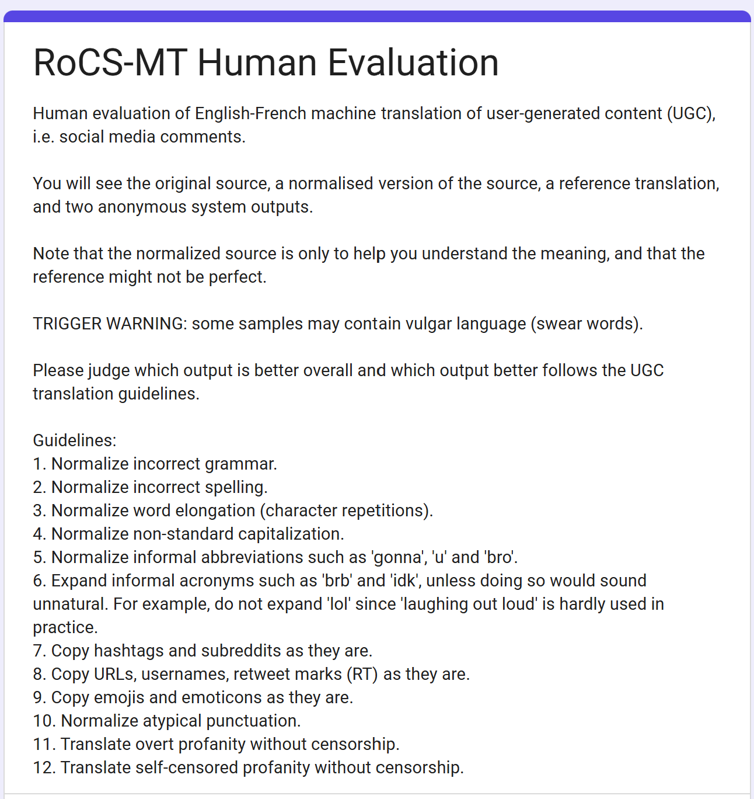
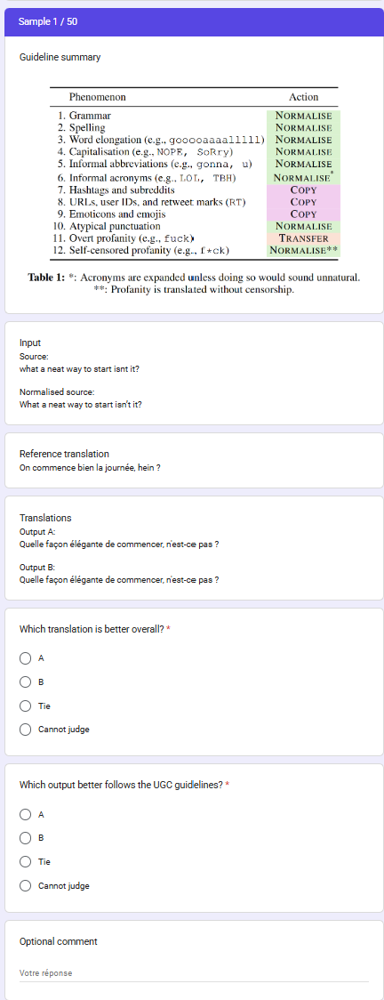

# Human Evaluation

This folder documents the human evaluation package structure and the script pipeline used to prepare, process, analyse, and compare human judgements for the UGC translation evaluation.

## Overview

The repository includes two main human evaluation packages:

- `human_eval/forms/ab_rocsmt_Gemma-2-9B_LLaMA-3.1-8B`
- `human_eval/forms/ab_pfsmb-dev_Gemma-2-9B_LLaMA-3.1-8B`

Each package contains a refactored layout for the form inputs, outputs, analysis, and supporting scripts.

The evaluation methodology is:

- Two UGC translation datasets are evaluated: RoCS-MT (English→French) and PFSMB (French→English).
- For PFSMB, the evaluation uses the PMUMT subset from Rosales-Nuñez et al. (2021).
- Original dataset taxonomies are mapped to a unified 12-category UGC taxonomy.
- Stratified sampling over the mapped categories produces 50 sentence pairs per dataset.
- Two models are compared: `Gemma-2-9B` and `LLaMA-3.1-8B`.
- The comparison uses the default prompt condition and a matching guideline prompt condition.
- Each human evaluation item shows the source, its normalised source, the reference translation, guidelines, and two anonymised system outputs.
- Annotators perform pairwise comparisons on both overall translation quality and guideline adherence.
- Four bilingual annotators participated; each sample received three annotations.
- Final preferences are derived via majority voting.
- Agreement is measured with Krippendorff's alpha and pairwise Cohen's kappa.
- Human judgements are compared to automatic metrics using COMET and COMETkiwi.

## Sampling and sample sources

The sampled items are stored in `human_eval/samples/` before package creation. Each sample directory contains the source sentence, a normalised source version, the reference translation, and metadata used by `src/build_ab_annotation_package.py`.

For `pfsmb`, the source text is first normalised automatically by `gpt-4o-mini` using the script `slurm/normalize_src.sh`. This returns `gpt.normed_source.txt`, which is then manually post-edited to produce the final `normed_source.txt` used in the package.

During package creation, the files from the sample directory are copied into the new `forms/.../inputs/` folder:

- `source.txt`
- `normed_source.txt`
- `reference.txt`
- `annotation_key.csv`

This ensures that the human evaluation form package is built from the sampled dataset and the manually verified normalised text.

## Folder structure

Each `ab_<corpus>_<models>` package follows this structure:

- `inputs/`
  - `source.txt`
  - `normed_source.txt`
  - `reference.txt`
  - `system_a.txt`
  - `system_b.txt`
  - `annotation_key.csv`
  - `rocsmt_guidelines.png` or `pfsmb_guidelines.png`
- `outputs/`
  - `annotation_sheet.csv`
  - `responses.tsv`
  - `human_annotations_long.csv`
- `analysis/`
  - `human_majority_votes.csv`
  - `human_krippendorff_alpha.csv`
  - `human_pairwise_agreement.csv`
  - `human_preference_distribution_3class.csv`
  - `human_preference_distribution_binary.csv`
  - `human_quality_adherence_contingency.csv`
  - `human_quality_adherence_tradeoff_summary.csv`
  - `human_majority_with_metrics.csv`
  - `human_metric_agreement.csv`
- `plots/`
  - PDF summary plots generated from the analysis results
- `scripts/`
  - `create_form.js`

## Generation pipeline

The scripts in root `src/` are used in the following order:

1. `src/build_ab_annotation_package.py`
   - Builds a human evaluation package from sampled data and model outputs.
   - Reads sampled `source.txt`, `normed_source.txt`, `reference.txt`, and `metadata.csv`.
   - Reads model outputs for both default and guided conditions.
   - Randomises `system_a` / `system_b` assignments and writes the package under `human_eval/forms/ab_<corpus>_<models>/`.
   - Writes `inputs/` and `outputs/` files including `annotation_sheet.csv` and `annotation_key.csv`.

2. Google Form creation
   - The package contains `scripts/create_form.js` for Google Apps Script.
   - This script is copied into a Google Apps Script project and expects `annotation_sheet.csv` and the guideline image to be in the same Drive folder.
   - In the repo, those files live in `../outputs/` and `../inputs/` respectively.

3. `src/process_human_eval_responses.py`
   - Converts the Google Form response TSV into a long annotation CSV.
   - Reads `outputs/responses.tsv` and `inputs/annotation_key.csv`.
   - Writes `outputs/human_annotations_long.csv`.

4. `src/compute_human_agreement.py`
   - Computes human agreement and majority votes from `outputs/human_annotations_long.csv`.
   - Writes agreement files into `analysis/`:
     - `human_majority_votes.csv`
     - `human_krippendorff_alpha.csv`
     - `human_pairwise_agreement.csv`

5. `src/analyze_human_preferences.py`
   - Analyses majority preferences and generates summary plots.
   - Reads `analysis/human_majority_votes.csv`.
   - Writes distribution and tradeoff CSVs into `analysis/`.
   - Produces PDF plots in `plots/`.

6. `src/compare_human_with_metrics.py`
   - Compares human majority preferences with automatic metrics.
   - Reads `analysis/human_majority_votes.csv` and metric JSON outputs from the experiment directory.
   - Writes:
     - `analysis/human_majority_with_metrics.csv`
     - `analysis/human_metric_agreement.csv`

## How the form package is organised

- `inputs/` contains the text fields and annotation key used to build the Google Form.
- `outputs/` contains the CSV sheet that is uploaded to Google Drive and the raw Form responses.
- `analysis/` contains aggregated human judgments, agreement statistics, and preference summaries.
- `plots/` contains visual summaries of the preference distributions and quality/adherence tradeoffs.
- `scripts/` contains the Google Apps Script used to generate the Form.

## Notes on the Google Apps Script

The script `scripts/create_form.js` is intended to be copied into Google Apps Script. It uses `annotation_sheet.csv` as the item source and `rocsmt_guidelines.png` / `pfsmb_guidelines.png` as the guideline image.

In the repo layout, those files are organised as:

- `inputs/rocsmt_guidelines.png` or `inputs/pfsmb_guidelines.png`
- `outputs/annotation_sheet.csv`

When copying the script into Google Apps Script, upload the CSV and image together in the same Drive folder.

## Example form snapshots

### Guideline page

### Sample evaluation page

## Notes

- `human_eval/samples/` contains sample data directories used to generate the form packages.
- The `human_eval/forms/` folder is the canonical location for completed human evaluation packages.
- The `human_eval/README.md` file documents the structure and pipeline for easy reproduction.
